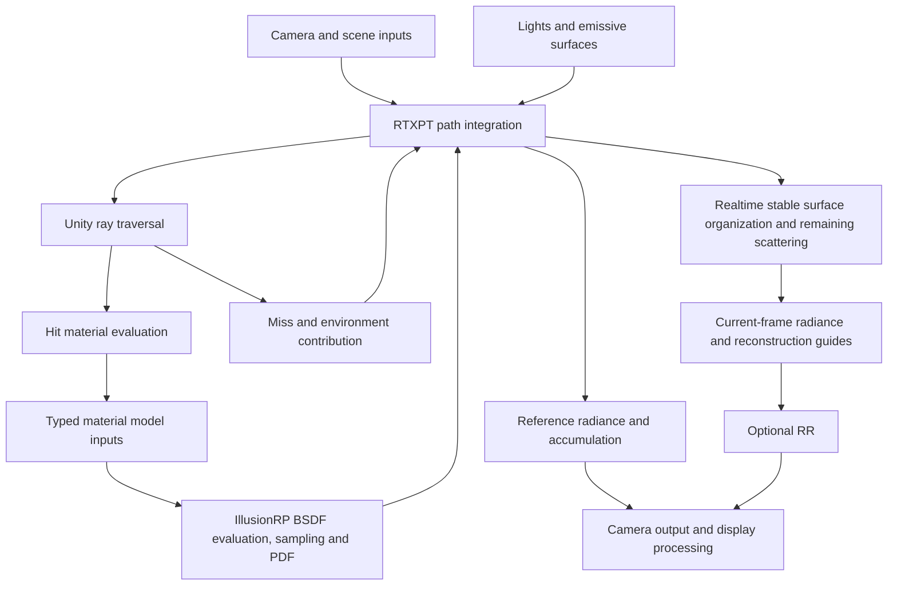

# Path Tracing

| Field | Value |
|---|---|
| Version | 1.3.2 |
| Status | Draft |
| Date | 2026-10-02 |

## Purpose and Scope

Path tracing is a camera rendering mode in IllusionRP. It shares scene, geometry, and material assets with raster rendering and is selected through configuration. It does not require a separate path tracing scene or duplicate material assets.

The system provides Reference and Realtime modes. Both share material models and lighting semantics; they differ in sampling budgets, history use, and image reconstruction. Reference progressively accumulates a static image. Realtime supports continuously changing scenes and cameras and can use Ray Reconstruction (RR).

This specification defines input, computation, output, and lifecycle contracts. It does not prescribe internal implementation, resource layouts, or code organization. Path tracing support does not imply that every raster shader can participate directly.

## Responsibilities and Data Boundaries

| Stage | Responsibility | Required Boundary |
|---|---|---|
| Scene input | Provide geometry, instances, material bindings, transforms, and motion information | Preserve asset and object identity; select participating objects through path tracing configuration |
| Material evaluation | Evaluate inputs for the selected material model at a ray hit | Use current materials and property overrides independently of the final raster color |
| Material model | Define scattering evaluation, direction sampling, and probability density | Use the same model and parameter semantics for all three |
| Path integration | Handle path continuation, direct and indirect lighting, visibility, and termination | Do not alter material formulas to compensate for input conversion errors |
| Reconstruction and output | Prepare reconstruction guides and deliver color, depth, and motion information | Reconstruction and display processing must preserve the physical meaning of materials and lights |

Unity owns compilation of material evaluation entry points, material property binding, and access to hit geometry. Shader authors are responsible for expressing the intended material inputs in raster and path tracing entry points. The system does not infer scattering models from the final raster color.

Material evaluation is separate from material models. Models share necessary hit information and express model-specific inputs by type. They do not require all models to depend on an ever-growing universal material data object. Path state carries only the information needed to continue a path; it does not replace material assets or scene definitions.

## Pipeline Architecture and Design Rationale

The pipeline combines Unity material evaluation, IllusionRP material models, and the RTXPT path integrator. These are separate responsibilities within one rendering path. Unity determines how a hit accesses geometry and evaluates shader-authored inputs. IllusionRP material models determine scattering. RTXPT determines how scattering events form paths and contribute to the image, including direct light sampling and Realtime path organization.

The material model exposes a bidirectional scattering distribution function (BSDF), covering reflection and transmission where applicable. Evaluating material inputs is not the same as evaluating the BSDF, and neither produces the final lit pixel. A material entry point supplies inputs such as color, roughness, normal, and model-specific parameters. The selected model turns them into a scattering response; the integrator combines that response with lighting and the rest of the path.

The following diagram shows the responsibility flow. The loop represents path continuation, not a separate material or rendering backend.

The architectural choices are:

| Decision | Reason and Consequence |
|---|---|
| Retain Unity shader compilation and material binding | Shader-authored texture combinations, UV transforms, and procedural inputs remain part of the material workflow. Participating shaders need a path tracing evaluation entry point; a fixed property-name conversion cannot replace arbitrary shader logic. |
| Separate material input evaluation from scattering models | Shader authors can customize how inputs are produced without implementing a path integrator or duplicating the scattering model. Sharing input functions with raster rendering is possible, but matching raster lighting is not an automatic guarantee. |
| Use one coherent material model layer for Lit, Fabric, Skin, and Hair | Each model owns its evaluation, sampling, and PDF together. Ordinary Lit does not use an integrator-provided standard model while other materials accumulate independent raster appearance approximations. |
| Retain RTXPT integration and Realtime path organization | Replacing the material layer does not require replacing path transport, light sampling, stable surfaces, or the data flow needed by RR. Reference and Realtime continue to share the same material contract. |
| Restrict the material-to-integrator boundary to semantic adaptation | Coordinate, probability, lobe, and throughput conventions may be adapted. Material formulas must not be rewritten inside the integrator to make a model fit. |

This design deliberately does not reproduce every raster shading feature in path tracing. Supported physical inputs retain their meaning; raster appearance controls without a corresponding model input are excluded. Unsupported materials are diagnosed rather than silently routed through a different standard BSDF. Adding a material model extends the material layer and its input contract, not a second path integration route or a replacement material asset system.

## Hit-to-Radiance Flow

The transport loop has the following semantic stages:

1. Generate a camera path and intersect the participating scene. A miss contributes environment radiance according to the path state; a hit provides geometry and material identity.
2. Evaluate the hit material using its shader entry point and current property overrides. Apply coverage rules, then produce the selected model's inputs and visible emission.
3. Prepare the material interaction. This includes model-specific state, incident medium information, and any subsurface propagation. If subsurface propagation moves the interaction, subsequent lighting uses the exit interaction.
4. Evaluate direct lighting and choose path continuation through the same BSDF contract. Account for visibility, light and material sampling probabilities, emission, and accumulated throughput.
5. Continue with the sampled direction or terminate under the configured path policy. Deliver the resulting radiance and corresponding surface information to the selected rendering mode.

The integrator owns path state and transport decisions. The material model owns the scattering distribution at the prepared interaction. Their boundary must provide:

| Operation or Information | Contract |
|---|---|
| BSDF evaluation | Return the scattering contribution for a specified direction, using the selected model and the prepared interaction |
| Direction sampling | Return a valid continuation direction, its probability, and the corresponding throughput multiplier |
| PDF evaluation | Return the probability density of the same sampling distribution for a specified direction, including the applicable mixture probabilities |
| Lobe classification | Distinguish diffuse and specular transport, reflection and transmission, and delta and non-delta events for transport decisions; a specular event is delta only when its lobe is perfectly smooth or below the reference renderer's minimum roughness, never because its sampled density is large |
| Delta branches | Describe discrete reflection or transmission branches and their weights for stable path organization; they must not be treated as ordinary continuous densities |
| Interaction and guide information | Describe the actual interaction and model response used by transport; guide estimates must not replace the BSDF |

BSDF evaluation for direct lighting and BSDF sampling for continuation must describe the same model. The adapter must preserve direction conventions, normal orientation, probability measures, and the meaning of sampled throughput. Projected-angle factors, mixture probabilities, and throughput multipliers must each be applied exactly once across this boundary. The integrator applies the returned continuation throughput multiplier once, without dividing it by its sampling PDF again.

Next-event estimation (NEE) samples light sources explicitly. Multiple importance sampling (MIS) combines that estimator with paths that reach light sources through BSDF sampling. Both estimators must use compatible PDFs, with discrete events handled separately. Changing a material model therefore requires a consistent evaluation, sampling, PDF, and lobe contract, rather than a replacement color formula alone.

Reference accumulates the radiance produced by this transport loop. Realtime additionally organizes transport around stable surface interactions and branches before evaluating the remaining scattering and preparing reconstruction inputs. These stable surfaces are transport and reconstruction anchors, not separate shading models. Both phases use the same material response; RR consumes the resulting image and guides without participating in BSDF evaluation or path integration.

## Scene and Material Inputs

Path tracing uses existing Renderer, Mesh, Material, and MaterialPropertyBlock inputs. Property overrides must retain their original scope and precedence, including overrides applied per object or per material slot.

Hit evaluation must preserve the meaning of geometry positions, UVs, vertex attributes, geometric normals, and tangent directions. Shading normals determine material response; geometric normals determine geometric orientation and ray origin placement. Neither may substitute for the other. UV transforms, texture channels, and decoding belong to the material evaluation contract.

Supported material semantics are:

| Model | Semantics |
|---|---|
| Lit | Surface reflection, plus coatings, thin or refractive transmission, and medium absorption expressed by the inputs |
| Fabric | A GGX lobe blended into a cloth lobe by the sheen intensity, following UE's Cloth model; Silk makes the GGX lobe anisotropic along its tangent |
| Skin | Surface reflection and volumetric subsurface scattering, with Random Walk and Diffusion Profile inputs for volume scattering |
| Hair | Marschner hair scattering, with response determined by material inputs and hair direction |
| Unlit | Visible color and emission for unlit materials, without presenting them as a lit scattering model |

Model selection must come from the material evaluation entry point, not object names, texture names, or visual appearance. Raster-only parameters participate only when they have corresponding path tracing semantics. Additional compensation formulas must not be introduced to preserve their raster appearance.

Coverage, alpha clipping, and physical transmission are distinct inputs. Coverage determines whether a ray accepts a geometric hit; transmission determines scattering after that hit is accepted. Main, shadow, and subsurface paths must follow their respective geometric tests while retaining consistent material coverage semantics. A shadow path returns colored transmission rather than a binary result: partial coverage passes the uncovered fraction, and a transparent, thin, or refractive surface passes its transmission. Shadow paths continue in a straight line through such surfaces.

The Hair model does not change the input geometry type. Hair cards remain cards and must not be treated as strand geometry merely because they use a hair scattering model.

Fabric keeps the inputs of the raster lighting, which blends the specular lobe into the sheen lobe by the sheen intensity. The cloth lobe uses the sheen color, the Charlie distribution, and the inverted GGX distribution of UE's Cloth model when the material is velvet. Silk takes its tangent from the same normal-map tilt as raster anisotropy. A separate sheen normal is not supported: no reference path tracer gives the cloth lobe its own normal.

A hair card stands for a whole volume of hair collapsed into one surface, so its base color is the color of that volume. The fiber absorption is chosen so that a single card interaction, averaged across the fiber at normal incidence, returns the base color as its total albedo. This deliberately differs from HDRP, whose mapping assumes the light bounces many times between strands and leaves single-layer cards nearly white. The scattering lobes, their distributions, and the fiber refraction stay those of HDRP. The fiber takes the roughness and specular inputs of the raster hair lighting, as UE gives one roughness and specular to both its raster and path traced hair: the raster Marschner roughness is the longitudinal roughness, and the specular sets the normal-incidence reflectance to 0.08 times its value, which also sets the fiber index of refraction. The fiber direction is the material's hair tangent, including stylized directions such as a ring around the head and their per-strand shifts; the shading frame keeps that direction and makes the normal orthogonal to it.

[Water](water.md) is a refractive Lit interface over an absorbing medium, as in UE's path tracer; it has no dedicated water model. A path that leaves the scene while inside an absorbing medium returns no light, since it would cross that medium without end.

Skin volume scattering requires closed geometry as valid input. A screen-space thickness approximation must not replace propagation through the volume.

Shaders without a path tracing material evaluation entry point must produce a clear diagnostic. A diagnostic surface must not be treated as a correct material result.

## Lighting and Path Integration

Path integration must account for visible emission, environment lighting, direct lighting, and indirect lighting. The probability densities for direct light sampling and path intersections with light sources must be consistent. Multiple importance sampling must prevent double counting and incorrect weighting.

Lighting inputs support environments, directional lights, point lights, spotlights, rectangular area lights, and emissive geometry. Light direction, color, intensity, size, and spotlight angles must retain their respective semantics. The angular size of a directional light is part of its lighting input: it softens the light's shadows without changing the irradiance the light delivers to unoccluded surfaces.

Color decoding, light intensity normalization, and world unit conversion occur exactly once at their respective input boundaries. Material models, path integration, exposure, and reconstruction must not apply further compensation. Subsurface scattering distances, medium absorption distances, and ray offsets must use a consistent world scale.

The current lighting contract uses physical distance attenuation. It does not apply Unity range cutoff attenuation or cookies. These settings must produce a limitation warning when relevant.

When the pipeline uses rendering layers, a light illuminates only renderers whose rendering layers intersect its own, and only renderers whose rendering layers intersect its shadow layers occlude it. The shadow layers follow the rendering layers unless the light declares custom shadow layers. The directional light that owns [per-object shadows](directional-per-object-shadows.md) for the camera is also occluded by renderers on the per-object shadow rendering layer, as its per-object shadow atlas is in raster. Emissive geometry and the environment illuminate every renderer and are occluded by every caster. A renderer's shadow casting mode decides how it takes part: Off makes it visible without occluding light, On and Two Sided make it visible and occluding, and Shadows Only makes it occlude light without being visible. As in HDRP path tracing, a light's shadow toggle does not disable occlusion, and light sources do not occlude other lights. Object participation layers are distinct from rendering layers.

Visibility must be evaluated from the actual scattering position. After subsurface scattering, both direct lighting and path continuation start at the exit position. Ray offsets serve only to avoid geometric self-intersection; they must not alter the actual exit position or output depth.

Path length and rough-surface bounce budgets must have explicit, consistent counting semantics. Budgets, termination policies, and direct light sampling settings must not be silently replaced based on material or rendering mode.

Firefly clamping and environment sampling smoothing are optional stability measures that change the estimate. They must be distinguishable from material parameters, and it must be possible to disable them. Disabling them does not make a finite path budget or finite sample count equivalent to a fully converged result. As in RTXPT, the firefly threshold is relative to the radiance that the current exposure maps to middle gray, and Reference and Realtime each have their own threshold.

## Camera Chains and Presentation

A camera chain is the camera ray together with its continuation through delta reflection and delta transmission events; it ends at the first non-delta scattering event. Camera chains carry what raster presents to the viewer, while scattered paths carry lighting.

- A camera chain that leaves the scene sees the camera background: the skybox when the camera clears to the skybox, otherwise the camera background color. Both are scene-linear radiance and take exposure like the rest of the image. The background does not follow the Environment Lighting source or its intensity multiplier; scattered paths that leave the scene see the lighting environment.
- An Unlit surface does not scatter. A camera chain that reaches it sees its display color; every other path sees only its baked emission, which takes part in light sampling like other emissive geometry. This deliberately differs from HDRP, where the unlit color also lights the scene.
- A multiply overlay is a presentation layer that raster multiplies over the surfaces behind it, such as an eye shadow. A camera chain reaching its front face takes its factor and continues behind it without counting a bounce; every other ray passes through it, so it neither occludes, emits, nor scatters, and it gives no thickness to volume scattering.
- A material may limit its visibility to camera chains, as a backdrop does; every other ray passes through it.

## Camera Rendering Flow

Each camera render follows this order:

1. Read the current camera, scene, and configuration; confirm that the camera type, device capabilities, and requested features are supported.
2. Update participating scene content and lighting; prepare consistent geometry, material, camera, and motion inputs.
3. Determine whether accumulation or history remains valid and execute the selected path tracing mode.
4. When RR is requested, provide matching guides and complete reconstruction before delivering color and depth to the camera.
5. Maintain history needed by the next frame, restore temporary camera state changes, and release unused resources.

Game base cameras and Scene View cameras can use path tracing. Overlay cameras and cameras that output only depth do not participate. Scene View uses Reference and does not enable reconstruction based on a game camera's Realtime configuration.

| Mode | Sampling and History | Output |
|---|---|---|
| Reference | Progressively accumulate under the same valid state; stop refinement at the sample budget | Accumulated linear color, independent of RR |
| Realtime | Use a finite sample budget per frame; retain stable surface and motion information for continuous rendering and reconstruction | Raw current-frame color or explicitly enabled RR output |

In Reference, changes to camera pose, projection, lens, geometry, transforms, materials, lighting, participating objects, or settings that affect the path estimate must invalidate accumulation. Changes limited to display processing must not contaminate linear accumulation.

In Realtime, stable surface information and subsequent scattering computation must use the same material evaluation result. Normal camera motion is represented by motion information. Camera cuts, missing history, size changes, or incompatible configuration changes must reset the affected history. History reuse must not treat invalid surfaces as valid inputs.

## Subsurface Scattering Contract

A Diffusion Profile defines the scale, scattering properties, and transmission properties needed for volume scattering. Raster and path tracing must use consistent profile identity and unit semantics.

Unassigned or unmatched profiles use neutral semantics and must not accidentally select the first valid profile. The number of valid profiles must remain within supported capacity. Each camera must receive a complete valid state rather than depend on values left by a previous camera.

A Random Walk exits only through surfaces of its own scattering group. A renderer is its own group by default; a `PathTracingScatteringGroup` component joins the renderers below it into one group, so meshes that together bound one volume share exits, while unrelated objects stay separate even when they touch or overlap. Group assignment is scene input: it does not change free-path sampling, scattering coefficients, or the volume model, and the exit surface still applies its coverage. This is a deliberate difference from HDRP, whose random walks exit through any surface.

Random Walk free paths, throughput, and probability densities must come from the same volume model. Random samples conditionally remapped during material selection must continue into the corresponding sampling step without changing their probability semantics between selection and sampling.

Random sampling depends on camera pixel, sample, and path segment identity. Subsurface scattering does not use screen-space convolution as its volume propagation process. Viewport size changes or world translations must not create fixed hard boundaries in scattering.

## Reconstruction and Output Contract

RR reconstructs Realtime images; it does not define material scattering or lighting models. Disabling RR produces the raw Realtime image. Its noise and flicker must not be presented as a Reference accumulation result.

Reconstruction inputs include linear color, depth, motion information, diffuse and specular guide colors, normals and roughness, and camera projection and jitter information. They must describe the same frame, view, and corresponding sample positions. Input dimensions, output dimensions, motion units, and projection conventions must agree. Resolution scaling must not affect only the color image.

Guides support reconstruction. Guide colors, exposure, and normals must not be altered to conceal material computation errors. Hits, misses, and unavailable history must remain distinguishable. Final valid images must not contain NaN or infinite values.

Path tracing output enters the IllusionRP display processing flow. Exposure, tone mapping, and post-processing remain separate from linear lighting computation. Depth and motion information must agree with the path tracing result for subsequent processing.

RR and DLSSNR are independent features. Path tracing mode and RR changes must not break DLSSNR input semantics or resource lifetimes. The presence of an image does not prove that reconstruction or neural rendering executed successfully.

## Raster Feature Interoperability

Screen-space [wet surface](wet-surface-decals.md) buffers are not path tracing material inputs. Path traced cameras keep their physical material models and reset the wet surface state, so no later camera reads wet results it did not produce. Raster cameras keep their wet surfaces when path tracing is disabled or unavailable.

## Lifecycle and Failure Behavior

Accumulation, motion history, and reconstruction history are isolated per camera. Reusable scene data must not let one camera overwrite another camera's valid inputs. Mode changes discard incompatible history. Re-enabling a mode must not reuse invalid results directly.

Path tracing replaces the relevant raster work only during its own rendering. Raster rendering remains available when path tracing is disabled, unavailable, or inapplicable to the camera. Temporary camera configuration changes must be restored without rewriting user scene, material, or configuration assets.

When RR is requested but unavailable, the system must explain the reason and retain raster rendering. It must not silently produce a raw Realtime image. Execution failures must be distinguished from capability query results; successful initialization alone does not establish successful execution.

Resources must remain valid throughout their use. Size changes, camera removal, and pipeline disposal must release invalid resources. Device loss stops subsequent GPU rendering and preserves the failure stage and error evidence. Old output must not be reused to claim success.

Diagnostics must describe feature state, input limitations, and execution failures. Unsupported features must not be presented as active. Repeated identical diagnostics must not obscure actionable errors.

## Conformance Requirements

A conforming implementation must demonstrate at least the following behaviors:

- Raster/PT switching uses the same material assets and restores camera state afterward.
- Reference and Realtime retain consistent material and lighting semantics without mixing incompatible history.
- Hits, misses, alpha, point lights, spotlights, and emissive geometry follow their input contracts; camera chains see the camera background, Unlit display colors, and multiply overlays.
- Lit, Fabric, Skin, and Hair inputs, evaluation, sampling, and probability densities are mutually consistent.
- Valid, unassigned, and unmatched Diffusion Profiles behave correctly; subsurface scattering exits have no fixed hard boundaries.
- Camera motion, viewport changes, and material or transform updates correctly update output and affected history.
- Actual RR and DLSSNR execution results can be checked rather than inferred from image presence.
- Output remains valid, failures can be located, and rendering does not rewrite original scene or material assets.

Conformance checks must target the contracts affected by a change. Sampling noise, unconverged residuals, and stable implementation errors must be distinguished. Color grading, exposure changes, and per-material tuning must not conceal computation errors.
